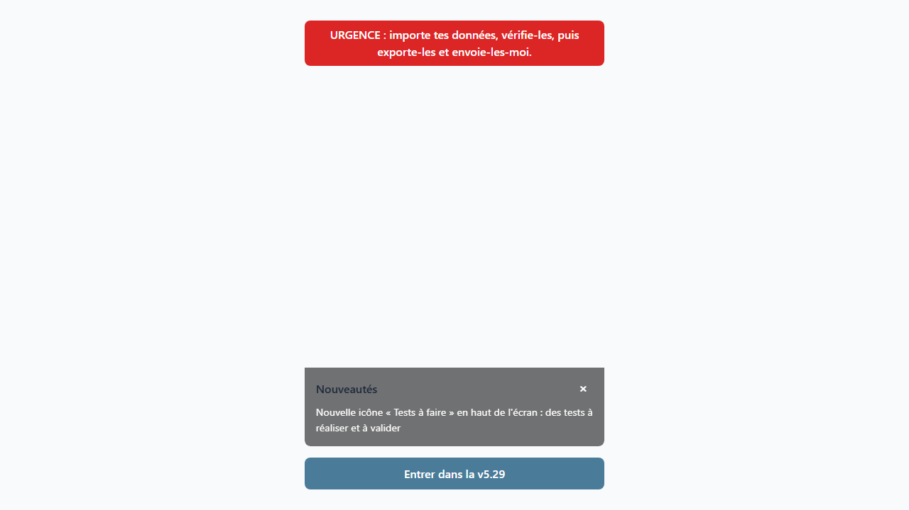

# Assistant AuDHD — planification et gestion d'énergie neuroinclusive

Assistant AuDHD est une application web progressive (PWA) conçue pour aider les personnes AuDHD (TSA et TDAH) à alléger leur charge mentale. Construite avec React, TypeScript, Vite et Dexie.js, elle fournit un système local de soutien aux fonctions exécutives : tâches, planification, énergie, outils personnels et tests manuels.

**English summary.** Assistant AuDHD is a neuroinclusive React and TypeScript PWA for autistic and ADHD people. It stores data locally with IndexedDB and helps users manage tasks, daily planning, energy, and personal tools without a cloud account.



## Fonctionnalités

- Réception et gestion de tâches, avec sous-étapes, durée, récurrence et exceptions.
- Planification quotidienne et suivi d'énergie, avec un mode de récupération en cas de surcharge.
- Listes, dossiers et outil Budget, organisés pour réduire les frictions de l'usage quotidien.
- Export et import local des données ; le stockage applicatif repose sur IndexedDB.
- Catalogue de tests manuels en langage clair, destiné à recueillir et archiver les retours d'usage.

## État actuel

La version **v5.84** est en production (déployée le 3 septembre 2026, premier déploiement depuis v5.69 du 31 août). Elle met en ligne un gros cumul de travail : le nouveau comportement du point rouge « Tests à faire », la réduction du poids de l'application, les trois dernières évolutions du planning (demandes 18-22) et l'intégralité des demandes 23 à 33 du Google Doc de Marie.

`roadmap_demandes_marie_2026-09-02.md` (demandes 23 à 33) est complète et déployée : texte des tâches sans couleur lisible une fois cochées ; couleur d'un outil appliquée à sa carte d'accueil ; sur le planning, nom et heure de début en haut de la case, heure de fin en bas, durée obligatoire pour planifier une tâche à une heure ; l'outil « Comptes » renommé « Mon compte » et l'écran Budget équivalent renommé « Prévisions » ; « Solde du mois » en tête de « Mon compte » qui baisse à chaque dépense ; carte « Prévisions » du Budget en positif et vert ; réglage de couleur pour la carte « Mon compte » ; retour de l'écran d'énergie directement vers l'accueil, avec suppression de l'ancien écran « Mon énergie » ; sous-tâches d'un élément de liste dépliables et cochables depuis la page de la catégorie ; et la correction des cadres qui débordaient à droite dans Paramètres > Accessibilité et dans le formulaire de tâche (traitée sur deux captures d'écran de Marie). Marie doit maintenant valider ces changements sur son téléphone : seize parcours l'attendent dans l'écran « Tests à faire ».

La synchronisation automatique des données de test vers Supabase (livrée en v5.69) reste en place : les données de chaque appareil sont sauvegardées toutes seules, sans export ni envoi manuel. Un script développeur (`scripts/backup_marie_snapshot.py`, lancé à chaque `/start` et `/close`) archive une copie datée du dernier snapshot de Marie dans `donnees_marie/`, pour pallier l'absence d'historique côté Supabase.

La roadmap `roadmap_sav_snapshot_marie.md` (trois phases) est close : les dix défauts relevés au test du 1er septembre 2026 sont corrigés. Une coupure réseau donne maintenant un message court au lieu d'une longue erreur technique ; une sauvegarde n'est réécrite que si le contenu a réellement changé (et non à chaque changement d'heure de synchronisation) ; le nom de fichier est horodaté en temps universel sans ambiguïté ; le script refuse d'écrire une sauvegarde vide. L'accès à Supabase est désormais partagé entre le script de sauvegarde et le script de lecture développeur. Un nettoyage du dossier `donnees_marie/` est disponible à la demande (`--prune`), jamais automatique. Une batterie de 31 tests automatiques couvre ces comportements. La sauvegarde est lancée à l'ouverture **et** à la clôture de chaque session de travail, pour raccourcir le délai pendant lequel une perte de données chez Marie pourrait effacer la dernière copie utilisable.

Le point rouge « Tests à faire » de l'accueil et la liste associée (commit `2d5c0b8`, déployé en v5.84) s'éteignent désormais dès qu'un test a été passé, qu'il soit marqué « Validé » ou « Non validé », et ne se rallument que pour un test neuf ou un test corrigé à repasser. Cela répond au retour de Marie du 1er septembre 2026. La roadmap `roadmap_sync_marie.md` est close et archivée : les données de Marie arrivent uniquement par synchronisation automatique, `/deploy` analyse le dernier snapshot Supabase archivé par `/start` et le traitement d'un export manuel devient un simple repli.

La roadmap `roadmap_gateway_discord_service.md` (trois phases) est terminée : l'agent DISCORD est devenu le point de contact unique du canal — il filtre la pertinence des messages sortants vers Marie (gardien de sortie), collecte et répartit tous les messages entrants vers le bon agent, et l'envoi réel de la file d'attente Discord est automatique (plus aucun envoi manuel). La troisième phase a été livrée sans mécanisme de « hooks » : toute la communication Discord se gère dans une session dédiée (`/discord_loop`, lancée automatiquement par `/start discord`) et les autres sessions ne s'en occupent que sur demande explicite. Un guide de forme (`DISCORD/discord_com/gateway/STYLE.md`) fixe le ton et les formulations des messages sortants, par destinataire, relu avant chaque validation d'envoi. Il reste un test manuel de bout en bout à passer avant d'archiver la roadmap.

Le 3 septembre 2026, Marie a transmis les deux captures d'écran demandées (Paramètres et formulaire de tâche) : la phase 10 de `roadmap_demandes_marie_2026-09-02.md` a été débloquée et corrigée le jour même, puis `/deploy` a été relancé (cible v5.84). Marie a depuis testé la v5.84 sur son téléphone (huit nouveaux résultats de parcours) ; ce retour reste à dépouiller pour mettre à jour le suivi des demandes.

Les branches Git obsolètes ont été supprimées le 31 août 2026 et `main` a été vérifié (build, tests et lint verts, arbre propre, synchronisé avec le distant). Les roadmaps `roadmap_bundle_2026-08-31.md` (bundle JavaScript ramené de 767 à 242 ko, −68 % : retrait de la bibliothèque cliente Supabase du navigateur, chargement différé des écrans, garde-fou automatique bloquant tout déploiement en cas de régression de taille) et `roadmap_e2e_2026-09-01.md` (57 tests end-to-end repassés au vert) sont closes et archivées dans `Archives/`. Le travail du bundle a été déployé en v5.84.

La roadmap `roadmap_planning_accueil_2026-08-29.md` (demandes 18-22 du Google Doc « Modifications » de Marie, toutes « Accueil / Planning », 5 phases) est close et archivée : hauteur de planning fixe sans plier/déplier, cases de tâches colorées sur toute leur hauteur, bandeau des jours au fond coloré (pas seulement le contour), défilement interne des jours avec grossissement du jour central, et nouvelle vue « Planning de la semaine » en pleine page (sept jours côte à côte, tâches en icônes, navigation identique à l'accueil). Les phases 1 et 2 étaient déjà en ligne avec v5.69 ; les phases 3, 4 et 5 sont déployées avec v5.84. Marie a tranché la navigation de la vue semaine (par semaine si les sept jours tiennent à l'écran, sinon par jour) ; ce point reste à confirmer sur son téléphone.

La version **v5.63** ajoute un registre de suivi des demandes du Google Doc de Marie réconcilié par `/analyser_googledoc`, `/deploy` et `/traiter_export_marie`, plus le champ `docRefs` du catalogue de tests.

La version **v5.62** rallume le point rouge de l’icône « Tests à faire » dès qu’un test reste à valider (révision comprise), en suivant exactement la liste de l’écran « Tests à faire ».

La version **v5.61** ajoute les montants temporaires par catégorie et période ; le parcours « Suivre ses dépenses avec Comptes » a été validé par Marie le 27 août.

Les roadmaps des 23 et 24 août sont archivées ; la roadmap du 25 août est livrée : retrait de « Terminer », couleur des outils dans Paramètres et accès direct à la modification d’énergie. La décision #11 reste à confirmer avec Marie pour les catégories mensuelles.

La version **v5.60** est déployée en production (voir le [CHANGELOG](CHANGELOG.md), HTTP 200 vérifié le 27 août 2026). Le parcours de tests manuels de Marie réaffiche désormais chaque test dont les étapes ont changé ; une validation est associée à la révision testée. Les tests sont regroupés en 7 catégories, repliées par défaut.

`roadmap_demandes_marie_2026-08-24.md` (17 demandes numérotées) est livrée avec v5.56 : menu de fiche de tâche simplifié, Budget repassé sur les montants prévus, ajout de dépense via la fiche de catégorie, formulaire de catégorie de liste corrigé sur mobile et retour direct à l’accueil après validation de l’énergie. Les décisions #7 (contenu de « Montant total ») et #11 (prévision limitée à une semaine) restent à clarifier avec Marie.

Le déploiement public est disponible sur [appli-audhd.netlify.app](https://appli-audhd.netlify.app).

Les éléments à transmettre à Marie sont centralisés dans [COMMUNICATION/Marie/a_transmettre.md](COMMUNICATION/Marie/a_transmettre.md) ; chaque déploiement en conserve une copie versionnée et la publie sur Drive.

## Prérequis

- Node.js et npm.
- Un navigateur récent pour utiliser ou tester la PWA.

## Installation et lancement

```bash
git clone https://github.com/ServOMorph/Appli_TSA_SDI_TDAH.git
cd Appli_TSA_SDI_TDAH
npm install
npm run dev
```

Ouvrez ensuite l'URL affichée par Vite, habituellement `http://localhost:5173`.

## Commandes utiles

```bash
npm run build          # vérification TypeScript et build de production
npm run preview        # prévisualisation du build
npm run lint           # ESLint sans avertissement accepté
npm test               # tests unitaires et d'intégration Vitest
npm run test:coverage  # couverture de tests
npm run test:e2e       # scénarios Playwright
```

## Architecture

```text
src/
  domain/    Logique métier pure : entités et règles de gestion
  data/      Persistance Dexie.js, IndexedDB et migrations
  ui/        Composants et écrans React accessibles
  app/       Navigation, providers et état applicatif
  test/      Utilitaires et configuration de tests partagés
scripts/     Scripts de développement et d'ingestion des retours de test
_docs/       Documentation produit, technique et ADR
_contexte/  Contexte et journal de suivi du projet
```

L'interface React reste séparée des règles métier et de la persistance. Les données utilisateur sont stockées localement dans IndexedDB ; la synchronisation cloud est un sujet post-MVP.

## Documentation

- [Changelog](CHANGELOG.md) : historique versionné des évolutions.
- [Roadmap des tests manuels](Archives/roadmap_tests_marie.md) : état du recueil des retours d'usage.
- [Décisions d'architecture](_docs/adr/) : choix techniques structurants.
- [Guide pour agents et IA](llms.txt) : synthèse du projet et de ses points d'entrée.

## Licence

Ce projet est distribué sous licence [MIT](LICENSE).
